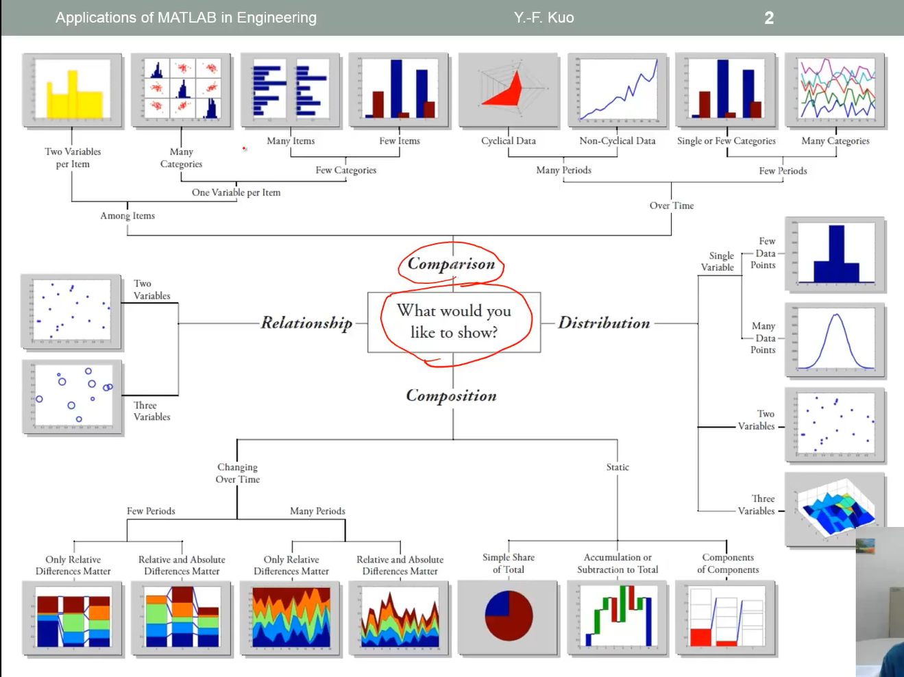
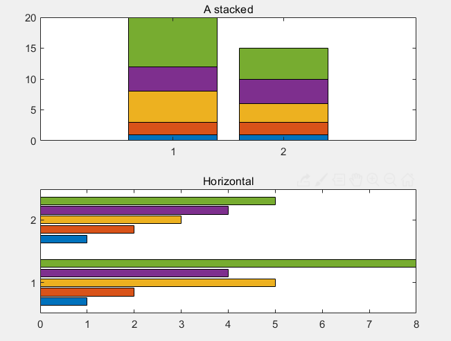
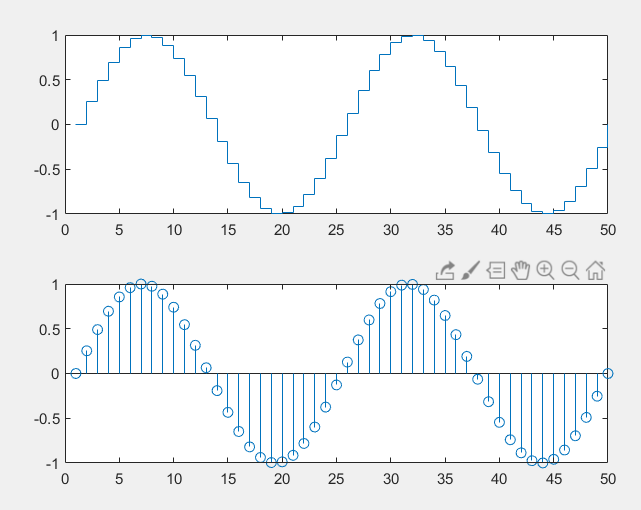
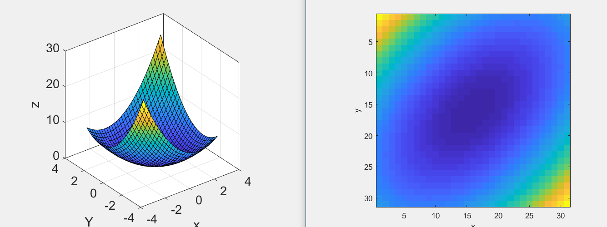
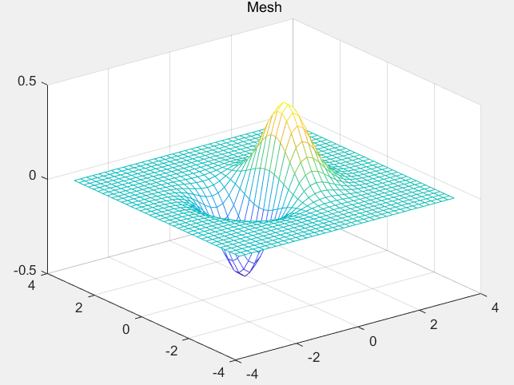

[TOC]

# MatLab Study
CS1703 Zhe-Yang

## Matlab as calculator

### Basic operations

\+ - * / ^

### Functions and Constants

sin() cos() tan()  radians

sind() cosd() tand()  use degree

log() : Nature logarithm also means **ln()**

log2()  log10() 

sqrt()  also (A)^0.5

π：pi        lower case

e:  exp(1)

complex number:

```matlab
1+3i
log() log2() log10()
sin() cos() tan() sqrt() 
```

### Embedding functions

such as:

```matlab
sin(cos(pi))
#it is equal to this
cos(pi)
sin(ans)
```

### Variables

Variables do NOT need to be declared.

### Numeric Variable Type

A number is *double* type in default.

View the type of a number:

```matlab
a=10
who    #view the variables
whos a #more info
```

### Special Variables and Constants

| Variable      | meaning             |
| ------------- | ------------------- |
| ans           | keyword             |
| i,j           | complex             |
| Inf           | ∞                   |
| eps           | extremely small num |
| NaN (Inf/Inf) | Not a Number        |

```matlab
>> iskeyword
    {'break'     }    {'case'      }
    {'catch'     }    {'classdef'  }
    {'continue'  }    {'else'      }
    {'elseif'    }    {'end'       }
    {'for'       }    {'function'  }
    {'global'    }    {'if'        }
    {'otherwise' }    {'parfor'    }
    {'persistent'}    {'return'    }
    {'spmd'      }    {'switch'    }
    {'try'       }    {'while'     }
```

#### when you use keyword

```matlab
>> cos='abcdefg'
>> cos(3)
ans = 'c'
```

This is denied! 

### Clear variables

`clear`: clear all variables

`clear sth` : clear a special variable

### Numeric Display "Format"

| Style  | Result                                    | Example(pi)           |
| ------ | ----------------------------------------- | --------------------- |
| short  | 4 digits after the point                  | 3.1416                |
| long   | 15 digits for double, 7 digits for single | 3.141592653589793     |
| shortE | Scientific notation with 4 digits         | 3.1416e+00            |
| longE  | Scientific notation with 15 or 7 digits   | 3.141592653589793e+00 |
| bank   | Currency format with 2 digits($3.14)      | 3.14                  |
| hex    | Hexadeciamal                              | 400921fb54442d18      |
| rat    | ratio of small integer                    | 355/113               |

### Command Line Teminal

```matlab
>> a = 10
>> a = 10;  # don't show the ans
>> clc  	# clear console
```


## Array(Vector and Matrix)

### Vector

```matlab
>> a = [1 2 3 4]  #Row vector
>> c = [1;2;3;4]  #Column vector
>> b = [1 2 3;3 4 5;5 6 7]
```

### Array Indexing

$$
A=\begin{vmatrix}
1&2&3\\
4&5&6\\
7&8&9\\
\end{vmatrix}
$$

```matlab
>> A(1,2)  #1st row 2nd col  ans = 2
>> A(8)	   #from top to bottom, left to right => ans = 6
>> A([1 3 5])   #ans = 1 7 5
>> A([1 3],[1 3])  #ans=A(1,1) A(1,3)\n A(3,1) A(3,3) ans = [1 3;7 9]
>> A(3,:)		#ans = [7 8 9]  ":" means ALL
>> A(:,3)		#ans = [2 5 8]'
>> A(3,:)=[]	#clear 3rd row which is used to delete all row or col
```

assignment

```matlab
>> A([1 2],[2 3])=0
```

$$
from\begin{vmatrix}
1&2&3\\
4&5&6\\
7&8&9\\
\end{vmatrix} to=>
\begin{vmatrix}
1&0&0\\
4&0&0\\
7&8&9\\
\end{vmatrix}
$$


### Colon operator

```matlab
>> A=1:3	#ans=[1 2 3]
>> A=1:2:5	#ans=[1 3 5]  gap is 2
>> A='a':2:'z'  #ans = 'acegikmoqsuwy'		
```


### Array Concatenation(数组连接如增广矩阵等)

```matlab
>> A=[1 2;3 4]; B = [9 9;9 9];
>> [A B] 	# ans=[1 2 9 9;3 4 9 9]
>> [A;B]	# ans=[1 2;3 4;9 9;9 9]
```


### Special Matrix

eye(n)  n*n的单位矩阵

zeros(m,n)   全是0的矩阵

ones(m,n)    全是1的矩阵

diag([2 3 4]) 对角线是2 3 4的矩阵

rand()	随机矩阵

## Array Manipulation

### Operator on array

> `+`  `-` `*` `/` `^` `.` `'`  7 operators

A + B  各个项相加，A - B同

A * B  同线代

A .* B  各个项相乘 A ./ B同

A / B ≈ A*inv(B)   B的逆矩阵

A'        A的转置矩阵(只能是方阵)

A 加减乘除2  各个项加减乘除2

A^2  就是矩阵的乘法

A .^ 2 各个项^2


### Matrix Related Functions

```matlab
max(A)		#get max num in every column
max(max(a)) #get max num in matrix
min(A)		#get min in every column
sum(A)		#get sum in every column
mean(A)		#get average in every column
sort(A)		#sort every column
sortrows(A) #sort matrix by first num in every row
size(A)		#show dimension
length(A)	
find(A==n)	#return the index which num equals to n 
```


## Script writing

It will be saved as a `\<file>.m` file.

In the `Editor` Layout, there is a button `fx` which is use to search function.

### Add comment

```matlab
 %this is comment
```

### Code section

```matlab
%%
this is section A

%%
this is section B
```

### Debug

add breakpoint. Click the head of a line. It will generate a grey point. And it will be red when debug it.

### Smart Indent

`Ctrl+I` to add some `tab` characters.

## Structured programming

### Flow control

`if,elseif,else`

`for`

`switch,case,otherwise`

`try,catch`

`while`


`break`

`continue`

`end`

`pause`

`return`

### Rational operators

`==` equal to

`~=` Not equal to

Others are same to C/C++.

examples:

```matlab
a=3;
if rem(a,2)==0
    disp('a is even')
else
    disp('a is odd')
end
```


```matlab
b=4;
switch b
    case 2
        disp("2")
    case 3
        disp("3")
    case 4
        disp("4")
end
```

 while语句

```matlab
n=1;
while prod(1:n)<2e8
    n=n+1;
end
```

pord()  是连乘


### Pre-allocating Space to variables

Not pre-allocating

```matlab
tic
for ii = 1:2000
	for jj = 1:2000
		A(ii,jj)=ii+jj
	end
end
toc
```

> 结果：时间已过 6.275641 秒。

Pre-allocating

```
tic
A = zeros(2000,2000)
for ii = 1:2000
	for jj = 1:2000
		A(ii,jj)=ii+jj;
	end
end
toc
```

> 时间已过 0.036444 秒。

tic toc  类似的滴答滴答的声音，表示计时

> So, the operation of pre-allocating is very crucial.

### Use ellipsis to make more readable

```matlab
%origin
A=[1 2 3 4 5 6; 6 5 4 3 2 1];
%It is too long, use ellipsis!
A=[1 2 3 4 5 6;...
   6 5 4 3 2 1];
%It is also belong to the same line.
```


## User-defined functions

### Format(View the content of build-in functions)

```matlab
>> edit(which("mean.m"))
```

You self defined function file name must be same to your function name.


Example:
$$
f(x)=x_0+y_0t+\frac{1}{2}gt^2
$$

```matlab
function y = freebody(x,v,t)
%FREEBODY this is free falling sport
%
   此处显示详细说明
y=x+v*t+0.5*9.8*t^2
end
```

**There is something to attach to importance**

如果传入参数是：

```matlab
>> freebody([0 1],[0 1],[10 20]);
```

> 它会提示：用于对矩阵求幂的维度不正确。请检查并确保矩阵为方阵并且幂为标量。要执行按元素矩阵求幂，请使用 '.^'。

```matlab
function y = freebody(x,v,t)
%所以我们需要改进一下
y=x+v.*t+0.5*9.8*t.*t
end
```


### Function with Multiple Inputs and Outputs

 ```matlab
function [a,F] = AccandForce(v1,v2,t1,t2,m)
a = (v1-v2)./(t1-t2);
F = a.*m;
end
 ```

Multiple parameters and return values.

### Exercise

Fahrenheit to Celsius

```matlab
function F2C()
while true
    F = input('please input the Fahrenheit:');
    disp(F);
    if isempty(F)
        break;
    end
    C = (F-32)*5/9;
    disp("Your Celsius is:"+C);
end
end
```

### Function Default Variables

`nargin` :number of function input args

`nargout`:number of function output args

`varargin`:

`varargout`:

### Function Handles-Anonymous Functions

```matlab
>> f=@(x)exp(-2*x);
>> x=0:0.1:2;
plot(x,f(x));
```

It's also called Anonymous Functions

## Variables：string，structrue，cell

### Type conversion

`double()` `single()` `int8()` `int16()`......

### Character(char)

```matlab
s1='a';
int8(s1);
```

### String

```matlab
s1='String'
s2='this'
```

String concatenation

```matlab
s3=[s1 s2];
s4=[s1;s2];%the length of s1 and s2 must be consistent.
```

String indexing

```matlab
a='aaabbbcccddd';
'b'==a;  %It will return a logical array
%0   0   0   1   1   1   0   0   0   0   0   0
a('b'==a)='Z';
a	%a='aaaZZZcccddd'.It will replace the 'b' character
```

### Structure

example:

```matlab
>> dog.age=1;
>> dog.high=20;
>> dog.mean="yes";
>> dog(2).age=2;
>> dog(2).high=15;
>> dog(2).mean="no";
>> dog(1) dog(2) %output
```

#### Structure Function

```matlab
fieldnames(dog);  	%返回属性值
c=rmdield(dog,'age');	%remove the field 'age'
```

### Cell Array

using bracket `{}`

two way of define Cell

```matlab
A(1,1)={[1 2 3]};   % First way
A{1,1}=[1 2 3];		%second way
```

It come up with *pointer*;

#### Cell array function

`cell()` `cell2mat` `cell2struct` `mat2cell` `num2cell`

example:

```matlab
a=magic(3);
b=num2cell(a);  %every entry to cell
c=mat2cell(a,[1 2],[2 1])  %target rows cols
```

### Multidimension Array

```matlab
A{1,1,1}=...
A{1,1,2}=...
.......

%%
% 或者用cat()
A=[1 2;3 4];B=[5 6;7 8];
C=cat(1,A,B); %C=[1 2;3 4;5 6;7 8];
C=cat(2,A,B); %C=[1 2 5 6;3 4 7 8];
C=cat(3,A,B); %C[:,:,1]=A C[:,:,2]=B
```


`reshape()` function:

A={4*4} 

reshape(A,1,16)  A={1\*16}  ... A={8\*2}


## Data access

You get Data from Cell Array:

```matlab
A{1,1}  %this enough
```


### File Access

save the ***workspace*** variables to files.

There is three type of files:

* .MAT	matlab formatted data			    load()    save()

* .txt           Space delimited numbers                       load()     save()

* .xls .xlsx    The EXCEL tools                                      xlsread()   xlswrite()

#### mat format

> You need save workspace data to a file   .mat
>
> then load

```matlab
save data1.mat         % zipped
save data2.mat -ascii  % not zipped
```

load file to workspace

```matlab
load data1.mat
load data2.mat -ascii
```

save/load specific variable

```matlab
a=2;
save data1.mat a;
clear;
load data1.mat a;
```


### Excel format

```matlab
%xlswrite(filename,var,sheet,location);
t="abcde";
xlswrite('a.xls',t,1); % A1:E1=a b c d e
xlswrite('a.xls',{t},2,'A2');% A2=abcde
```

Getting text from Excel

```matlab
xlsread(file);
```


### Low-level File I/O

fid = `fopen(Filename,format)`

`fclose(fid)` 

`fscanf(fid,"%8.4f",a)` 

`fprintf`

 `feof` 

```matlab
while ~feof(fid)
	a=fscanf(fid,"%5c",1);
end
```


## Basic plotting

### basic

```matlab
plot(cos(0:pi/20:2*pi));
```

### multi paint

```matlab
hold on
plot(cos(0:pi/20:2*pi));
plot(sin(0:pi/20:2*pi));
hold off
```

*'hold on'* order will not refresh the paint.

*hold off* will cancel it.

or

```matlab
>> x=-2*pi:pi/30:2*pi;y=sin(x);z=cos(x);
>> plot(x,y,'gx--',x,z,'ro-');
```

### plot style

example:

```matlab
plot(x,y,'gx--');  //green cross and solid line
```

the style is Data markers, then the line types, colors.

[Document](https://www.mathworks.com/help/releases/R2019a/symbolic/plot-style-and-settings.html?s_tid=doc_srchtitle)

### Add legend(图示) to graph

```matlab
x=-2*pi:pi/30:2*pi;y=sin(x);z=cos(x);
plot(x,y,'gx--',x,z,'ro-');
legend('sin(x)','cos(x)');
```

### Add title and Labels

```matlab
x=-2*pi:pi/30:2*pi;y=sin(x);z=cos(x);
plot(x,y,'gx--',x,z,'ro-');
legend('sin(x)','cos(x)');
xlabel('x');ylabel('f(x)');title('Go function');
```

### text() and annotation()

> Text with mathematical expression use LaTex 

```matlab
str='$$ \int_{0}^{2} x^2\sin(x)dx $$';
text(x,y,str,'Interpreter','latex');
```

> annotation: draw a arrow


Exercise:
```
x=linspace(1,2,100);
y=x.*x;
z=sin(2*pi*x);
plot(x,y,'black',x,z,'or');
xlabel('Times(ms)');ylabel('f(t)');title('Mini Assignment #1');
legend('t^{2}','sin(2\pit)');
```


### Figure Adjustment

Font   Font size  Line width  Axis limit Tick(测度) position Tick lable

`Figure properties`

**method:**

gca		return the handle of current axis.

gcf		return the handle of current fugure.

allchild	find all of children of specific 

```matlab
h=plot(x,y);		%get handle
get(h);				%get(gca)   get(gch)
set(gca,'YLim',[-1.2,1.2]);
set(gca,'FontSize',25);	%font size
set(gca,'XTick',0:pi/3:2*pi);
set(gca,'XTickLabel',0:90:360);
```

`get(h)`: get h's properties.


More style: refer to document.

### Multiple Figure

```matlab
clear
x=-10:0.1:10;
y1=x.^2-8;
y2=exp(x);
figure('Position',[150,150,380,380]), plot(x,y1);
figure, plot(x,y2);
```

### several plots in a figure

```matlab
x=-10:0.1:10;
y1=x.^2-8;
y2=exp(x);
subplot(1,2,1); plot(x,y1);
subplot(1,2,2);plot(x,y2);
```

### control of Grid box and Axis

```matlab
grid on/off
box on/off
axis on/off
axis normal
axis square...
axis ij/xy
```

### save figure to image

高解析度图像参考`print`

## Advance 2D plotting




### Special ploting

`loglog()`    两个轴都取对数

`semilogx()`    对x轴取对数

`semilogy()`	对y轴取对数

```matlab
x=logspace(-1,1,100);% 从10^-1  到 10^1
y=x.^2;   % 从10^-2  到 10^2
subplot(2,2,1);
plot(x,y);
title("Plot");
subplot(2,2,2);
semilogx(x,y);
title("semilogx");
subplot(2,2,3);
semilogy(x,y);
title("semilogy");
subplot(2,2,4);
loglog(x,y);
%set(gca,'XGrid','on');
```


`ployy()`的使用

```matlab
x=0:0.01:20;
y1=x.*x;
y2=3*x+3;
[ax,h1,h2]=plotyy(x,y1,x,y2); %axis figure 1 figure 2
title("Use plotyy");
set(get(ax(1),'YLabel'),'String','x^2');
set(get(ax(2),'YLabel'),'String','y=3x+1');
set(h1,"LineStyle",':');set(h2,"LineStyle",'--');
```

### histogram(直方图)

`hist()`

```matlab
y=randn(1,1000);
subplot(2,1,1);
hist(y,10);% divide this histogram to 10 pieces
title("bins=10");
subplot(2,1,2);
hist(y,50);% divide this histogram to 50 pieces
title("bins=50");
```

### bar chart(条形图)

```matlab
x=[1 2 5 4 8];y=[x;1:5];
subplot(3,1,1); bar(x);title('A bar chart of vector x');
subplot(3,1,2); bar(y);title('A bar chart of vector y');
subplot(3,1,3); bar3(y);title('A 3Dbar chart of vector y');	%3d show of bar chart
```

#### stacked and horizontal bar chart



```matlab
x=[1 2 5 4 8];y=[x;1:5];
subplot(2,1,1); bar(y,'stacked');title('A stacked');
subplot(2,1,2); barh(y);title('Horizontal');
```

### Pie chart

```matlab
a=1:5;
subplot(1,3,1);pie(a);
subplot(1,3,2);pie(a,[0 0 0 0 1]);%1 means 'departed'
subplot(1,3,3);pie3(a,ones(1,5));  % 3D
```

### Polar chart

```matlab
x=1:100;theta = x/10;r = log10(x);
subplot(1,4,1);polar(theta,r);
theta=linspace(0,2*pi);r=cos(4*theta);
subplot(1,4,2);polar(theta,r);
theta = linspace(0,2*pi,6);r=ones(1,length(theta));
subplot(1,4,3);polar(theta,r);
theta=linspace(0,2*pi);r=1-sin(theta);
subplot(1,4,4);polar(theta,r);
```


### Stairs and Stem chart

```matlab
x=linspace(0,4*pi,50);y=sin(x);
subplot(1,2,1);stairs(y);
subplot(1,2,2);stem(y);
```




### Other plot

1. Boxplot
2. ErrorPlot(误差图)


### Stop sign:stop_sign:

鲜花一个8边形

```matlab
t=(1:2:15)'*pi/8;
x=sin(t);y=cos(t);
fill(x,y,'r');
axis square off;
text(0,0,"LOVE",'Color','w','FontSize',80,'FontWeight','bold','HorizontalAlignment','center');
```

## Color Space

[R G B]

### 3D chart

`meshgrid()`     `imagesc()`



```matlab
[x,y]=meshgrid(-3:.2:3,-3:.2:3);
figure;
z=x.^2+y.^2+x.*y;surf(x,y,z);
box on;set(gca,'FontSize',16);axis square;
xlabel('x');ylabel('Y');zlabel('z');
xlim([-4,4]);ylim([-4,4]);
figure
imagesc(z);axis square;xlabel('x');ylabel('y');
```

### colorbar and colormap

colorbar  添加一个色度条

colormap(hot/cool/grey).....   document

## 3D plots
### line
```matlab
plot3(x,y,z,'r',x1,y1,z1,'b');
```
### surface

`mesh()` and `surf()`

```matlab
x = -3.5:0.2:3.5; y = -3.5:0.2:3.5;
[X,Y] = meshgrid(x,y);
Z = X.*exp(-X.^2-Y.^2);
figure;mesh(X,Y,Z);title('Mesh');
figure;surf(X,Y,Z);title('Surf');
```




### Contour

```matlab
[C,h]=contour(Z,[-.45:0.5:.45]);
clabel(C,h);
contourf(Z);  %填充颜色
meshc();
surfc();    %网格+contour（刨面图）
```

### 3D attributions

```matlab
sphere(50);shading flat;
material shiny;axis vis3d off;
set(gcf,'Color',[1 1 1]);
light('Position',[1 3 2]);
light('Position',[-3 -1 2],'Color','r'); %light attr
view(-45,20);		%View angle
```

### polygons

too difficult

## Polynomial differentiation and integration

多项式的微分和积分

> 这个貌似不支持对于负指数幂运算

### Polynomial format

use row vector to delegate the polynomial
$$
f(x)=9x^3-5x^2+3x+7(-2≤x≤5)
$$

```matlab
a=[9 -5 3 7];x=-2:0.01:5;
f=polyval(a,x);
plot(x,f,'LineWeight',2);
```

### Polynomial Differentiation(微分)

$$
f(x)=5x^4-2x^2+1
$$

`polyder()`

```matlab
a=[5 0 -2 0 1];
polyder(a);
polyval(a,7)  % f'(7)
```

Exercise
$$
f(x)=(20x^3-7x^2+5x+10)(4x^2+12x-3)
$$
Q: what is it's derivative for -2≤x≤1

```matlab
a=[20 -7 5 10];b=[4 12 -3];
c=conv(a,b);x=-2:0.01:1;
hold on
f=polyval(c,x);%f(x)
plot(x,f,'r-.');xlabel('x');ylabel('f(x)');
f1=polyval(polyder(c),x);%f'(x)
plot(x,f1);legend('f(x)','f(x)');
```

### Polynomial integration

`polyint(p,const)` 给p积分，并且添加积分

```matlab
p = [5 0 -2 0 1];
polyint(p,2)
```

### Numerical Differentiation

> 数值积分和多项式积分的区别就在于多项式积分无法对于比如三角函数这些来进行积分或者微分

`diff()`： get the gap of vector

#### Find a *f'(x)* over an interval [0,2π]

example **sin'(x)**

```matlab
h=0.5;x=0:h:2*pi;
y=sin(x);m = diff(y)./diff(x);
```

### Multiple Derivatives(多阶导)

```matlab
x=-2:0.01:2;y=x.^3;
m=diff(y)./diff(x);
m2=diff(m)./diff(x(1:end-1));
plot(x,y,x(1:end-1),m,x(1:end-2),m2);
```

### Numerical Integration

#### Mid point rule

 ```matlab
h=0.01;x=0:h:2;
midpoint=(x(1:end-1)+x(2:end))./2;
y=4*midpoint.^3;
s=sum(h*y)
 ```

#### Trapezoid rule(梯形法)

```matlab
h=0.05;x=0:h:2;y=4*x.^3;
s=h*trapz(y)
```

`trapz()`的作用是将两个数字取平均

### 1/3 Simpson‘s 


```matlab
h=0.05;x=0:h:2;y=4*x.^3;
s=h/3*(y(1)+2*sum(y(3:2:end-2))+4*sum(y(2:2:end))+y(end))
```

### Comparison


### Function methods

`integral()`

```matlab
y=@(x)1./(x.^3-2*x-5);
integral(y,0,2)
```

#### Double and Triple integrals

`integral2()`
$$
f(x,y)=\int_{0}^{π}\int_{π}^{2π}(ysin(x)+xcos(y))dxdy
$$

```matlab
f=@(x,y)y.*sin(x)+x.*cos(y);
integral2(f,pi,2*pi,0,pi);
```

`integral3()` 类似于二重积分

## Equation problem

### Symbolic Approach

use symbol to sign as variables.

`syms` or `sym()`

```matlab
syms x
x+x+x
(x+x+x)/4
```


### Root find

emmbaded function:

`solve()`  this eq y=x*sin(x)-x=0

```matlab
syms x;
y=x*sin(x)-x;
solve(y,x)
```


#### Multiple Equations

$$
x-2y=5\\
x+y=6
$$

```matlab
syms x y;
eq1 = x - 2 * y -5;
eq2 = x + y - 6;
A = solve(eq1,eq2,x,y);
A.x
A.y
```

$$
ax^2-b=0
$$

```matlab
syms x a b
solve(a*x^2-b)
% This is answer
  b^(1/2)/a^(1/2)
 -b^(1/2)/a^(1/2)
```

if you need to show 'b'

```matlab
syms x a b
solve(a*x^2-b,b)

% End
ans = a*x^2
```

$$
(x-a)^2+(y-b)^2 = r^2
$$

```matlab
syms x y a b r;
eq = (x-a)^2+(y-b)^2-r^2;
solve(eq,x)
```

$$
A=\begin{vmatrix}
a&b\\
c&d
\end{vmatrix}
$$

求A的逆矩阵

```matlab
syms a b c d
A = [a b;c d];
inv(A)
```

### Symbolic differentition

$$
y=4x^5
$$

```matlab
syms x;
y=4*x^5;
diff(y[,x])
```

### Symbolic Integration

$$
z=\int{x^2e^x}\,dx\\
z(0)=0
$$

```matlab
syms x;
y=x^2*exp(x);
z=int(y);
z=z-subs(z,x,0);
```

### Function handle(@)

`sin()` is a function, `@sin()` is a handle,it can be a parameter.

```matlab
function [y] = xy_plot(input,x);
y=input(x);
plot(x,y,'r--');
xlabel('x');ylabel('f(x)');
end
```

the parameter is a handle of **Function**

### Numeric solver

`fsolve(handle,guess,option)` 得到离guess值最近的解，如果两解距离guess相同，可能会得不到对应的值
$$
f(x)=xsin(x)+1.2x+0.3
$$

```matlab
f = @(x)(x*sin(x)+1.2*x+0.3);
fsolve(f,0)
%fsolve(function handle, initial guess)
f = @(x)(x^2);
options = optimset('MaxIter',1e2,'TolFun',1e-10);
fsolve(f,-0.1,options)
%% 不加option时0.0063 加之后时1e-16
```

`fzero(handle,guess,option)` 只有通过x轴的解才会显示，**相切的不算**（用fsolve）

```matlab
%%
f=@(x)(x.^2);
fzero(f,0.1)

%%
f=@(x)(x.^2 - 4);
fzero(f,0.1)
```

### Find roots of Polynomials

`roots()`

```matlab
roots([r1 r2 r3 r4])
```

### Newton-Raphson Method

$$
x_{n+1}=x_n-\frac{f(x)}{f^{'}(x)}
$$

### Recursive Function

easy